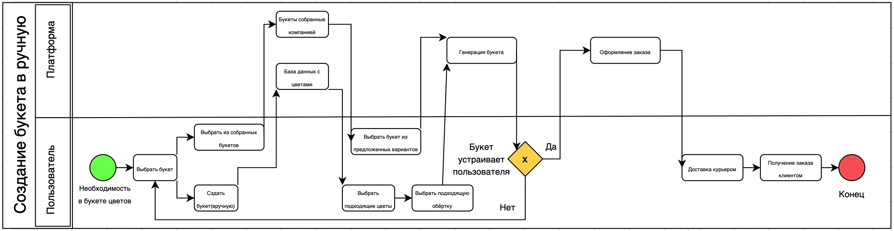
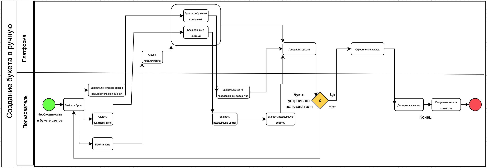

# Сравнение бизнес-процессов AS-IS и TO-BE для платформы "FloralMatch"

Анализ бизнес-процессов является важной частью развития платформы, так как позволяет выявить текущие проблемы и определить возможные улучшения. Для платформы "FloralMatch" выполнено сравнение процесса выбора и создания букета в его текущем состоянии (AS-IS) и в оптимизированном будущем состоянии (TO-BE). Это поможет повысить удобство, персонализацию и качество сервиса для конечных пользователей.

## Процесс AS-IS

В текущем состоянии (AS-IS) пользователи платформы начинают с необходимости вручную выбирать цветы или готовые букеты из предложенного списка. Процесс предполагает следующие этапы:

1. **Пользователь вводит критерии вручную** (например, тип букета, предпочтения или случайный выбор).  
2. **Система предлагает готовые варианты букетов**, собранные ранее.  
3. **Пользователь просматривает предложенные букеты** и выбирает подходящий.  
4. Если пользователь не доволен, **он вручную создает новый букет**, добавляя и редактируя отдельные цветы.  
5. **Завершение заказа** — выбор упаковки, оформление доставки, подтверждение.  

Данный процесс наглядно представлен на рисунке 1.

### Основные недостатки процесса AS-IS:

- **Отсутствие автоматизации**. Пользователь тратит много времени на ручной выбор цветов или композиций.  
- **Недостаточная персонализация**. Выбор не учитывает индивидуальные особенности пользователя (темперамент, знак зодиака, сезонность).  
- **Сложность выбора**. Вручную создавать букет неудобно, особенно для пользователей без опыта в подборе цветов.  
- **Риск ошибок**. Ручной ввод данных увеличивает вероятность пропуска важных деталей (например, несовместимых цветов).  

---

## Процесс TO-BE

Оптимизированный процесс TO-BE устраняет недостатки текущего подхода, внедряя автоматизацию и персонализацию. Предлагаемый процесс включает:

1. **Заполнение анкеты**. Пользователь указывает базовые данные (знак зодиака, темперамент, повод, предпочтения).  
2. **Анализ предпочтений**. Система автоматически анализирует введенные данные, используя встроенные алгоритмы астрологии и психологии.  
3. **Генерация предложений**. Платформа предлагает персонализированные варианты букетов, подходящие под введенные параметры. Каждый букет содержит описание с объяснением его соответствия характеристикам пользователя.  
4. **Редактирование**. Пользователь может вручную скорректировать выбранный букет (добавить/убрать цветы, изменить упаковку).  
5. **Оформление заказа**. Завершающий этап включает выбор упаковки, подтверждение доставки и размещение заказа.  

Процесс TO-BE представлен на рисунке 2.

### Преимущества процесса TO-BE:

- **Индивидуальный подход**. Генерация букетов на основе персональных данных пользователя (астрология, психология).  
- **Автоматизация**. Система автоматически создает предложения, сокращая время на выбор.  
- **Гибкость**. Возможность ручного редактирования позволяет удовлетворить индивидуальные запросы пользователя.  
- **Увлекательность**. Личное участие в процессе создания букета, усиленное персонализированными рекомендациями, делает процесс выбора более интерактивным и интересным.  
- **Снижение ошибок**. Исключается необходимость ручного ввода данных, что минимизирует риск несовместимости цветов.  

---

## Заключение

Переход от процесса AS-IS к TO-BE позволяет значительно улучшить пользовательский опыт на платформе "FloralMatch". Оптимизированный процесс обеспечивает удобство, сокращает время на выбор букета и добавляет смысловую нагрузку подарку за счет персонализации.

Для визуального представления прилагаются диаграммы процессов AS-IS и TO-BE:

1. **AS-IS**:  
     

2. **TO-BE**:  
     
 
