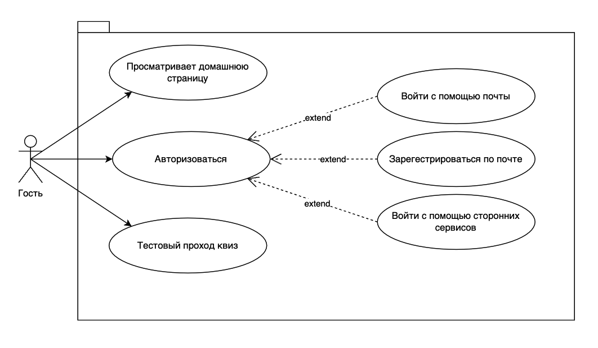
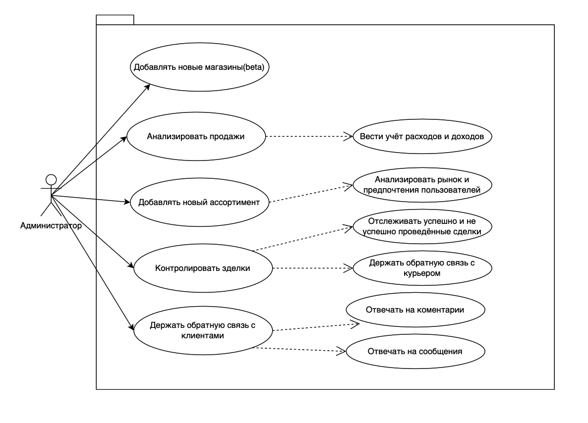
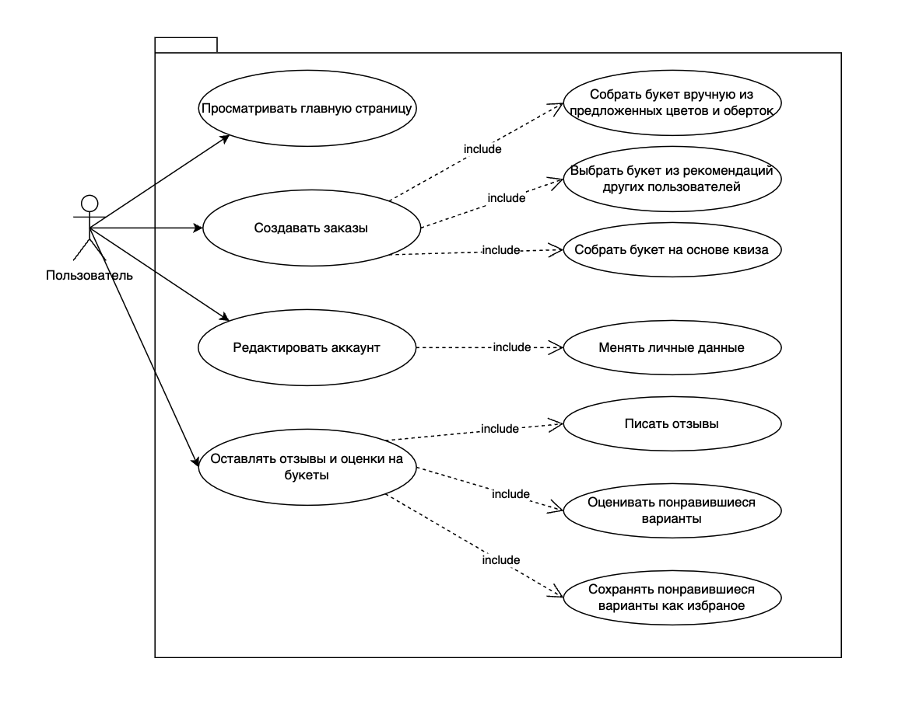

# Сценарии использования платформы "FloralMatch"

## 1. Сценарии для гостя

### 1.1 Просмотр домашней страницы
**Актор:** Гость  
**Цель:** Ознакомиться с платформой и её функциональностью.  
**Описание:** Гость может изучить главную страницу, получить общее представление о платформе и ознакомиться с предложениями.  

### 1.2 Авторизация
**Актор:** Гость  
**Цель:** Получить доступ к персонализированным функциям платформы.  
**Описание:** Гость может выбрать один из способов авторизации:  
- Войти с помощью электронной почты  
- Зарегистрироваться по электронной почте  
- Войти с помощью сторонних сервисов (например, Google, Facebook)  

### 1.3 Тестовый проход квиза
**Актор:** Гость  
**Цель:** Протестировать возможности квиза перед регистрацией.  
**Описание:** Гость может пройти тестовый квиз, чтобы увидеть, как платформа подбирает рекомендации.

**Схема гостя**:  
     

---

## 2. Сценарии для администратора

### 2.1 Добавление новых магазинов (beta)
**Актор:** Администратор  
**Цель:** Расширить ассортимент магазинов на платформе.  
**Описание:** Администратор может добавить новые магазины, которые будут доступны пользователям.  

### 2.2 Анализ продаж
**Актор:** Администратор  
**Цель:** Оценить эффективность продаж и управлять доходами.  
**Описание:** Включает возможности:  
- Ведение учёта расходов и доходов  
- Анализ рынка и предпочтений пользователей  

### 2.3 Добавление нового ассортимента
**Актор:** Администратор  
**Цель:** Увеличить выбор для пользователей.  
**Описание:** Администратор может добавлять новые товары в каталог.  

### 2.4 Контроль сделок
**Актор:** Администратор  
**Цель:** Обеспечить качественное выполнение сделок.  
**Описание:** Администратор отслеживает успешные и неудачные сделки, а также взаимодействует с курьерами.  

### 2.5 Обратная связь с клиентами
**Актор:** Администратор  
**Цель:** Улучшить пользовательский опыт.  
**Описание:** Включает:  
- Ответы на комментарии  
- Ответы на сообщения пользователей 

**Схема администратора**:  
    

---

## 3. Сценарии для пользователя

### 3.1 Просмотр главной страницы
**Актор:** Пользователь  
**Цель:** Ознакомиться с платформой и предложениями.  
**Описание:** Пользователь может изучить главную страницу и текущие рекомендации.  

### 3.2 Создание заказов
**Актор:** Пользователь  
**Цель:** Собрать и оформить заказ букета.  
**Описание:** Возможности:  
- Собрать букет вручную из предложенных цветов и упаковки  
- Выбрать букет из рекомендаций других пользователей  
- Собрать букет на основе квиза  

### 3.3 Редактирование аккаунта
**Актор:** Пользователь  
**Цель:** Управлять личными данными.  
**Описание:** Пользователь может изменять свои данные, например, имя, email и настройки аккаунта.  

### 3.4 Оставление отзывов и оценок
**Актор:** Пользователь  
**Цель:** Делиться впечатлениями и помогать другим пользователям.  
**Описание:** Включает:  
- Написание отзывов  
- Оценку понравившихся вариантов  
- Сохранение понравившихся вариантов как избранное  

**Схема пользователь**:  
    
